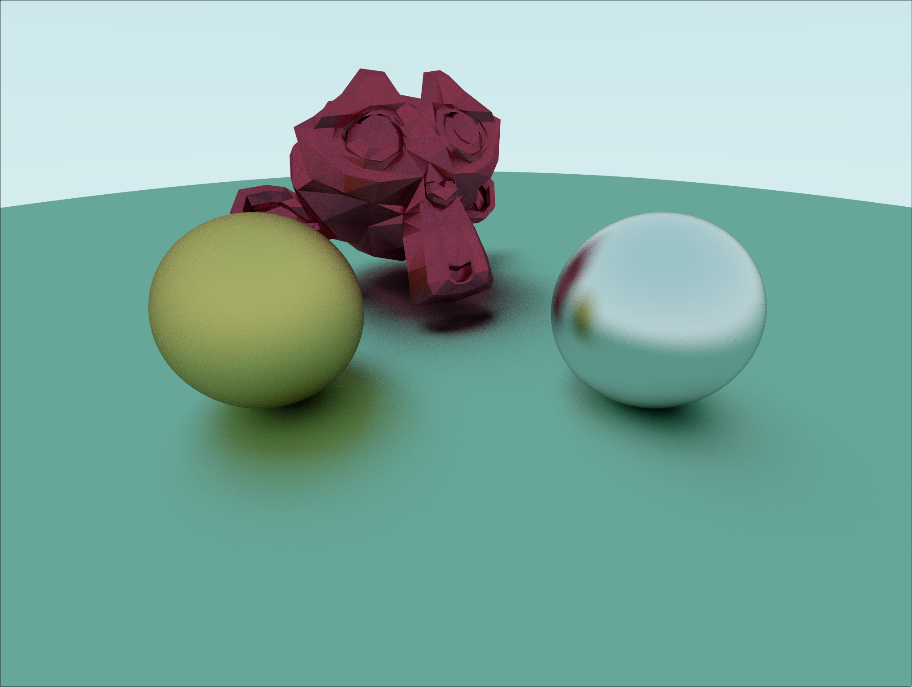

# Physically-Based Renderer
A physically based path tracer based off the renderer described [Physically Based Rendering: from Theory to Implementation](https://pbr-book.org).  Some initial code was also taken from [Raytracing in a Weekend](https://www.realtimerendering.com/raytracing/Ray%20Tracing%20in%20a%20Weekend.pdf)

## Features
* Shapes
    - Spheres
    - Triangle Meshes
    - Supports OBJ files
* Materials
    - Diffuse
    - Metalic with roughness
* Lights
    - Ambiant lighting from sky
* Live preview
* Multi-threading
* BVH Acceleration Structures

## Screenshots
Two spherers and a hex-torus triangle mesh.  No BVH.  Took 16 minutes to render 64 samples per pixel

Scene with a complex triangle mesh of a monkey head.  BVH with Middle partition trategy.

